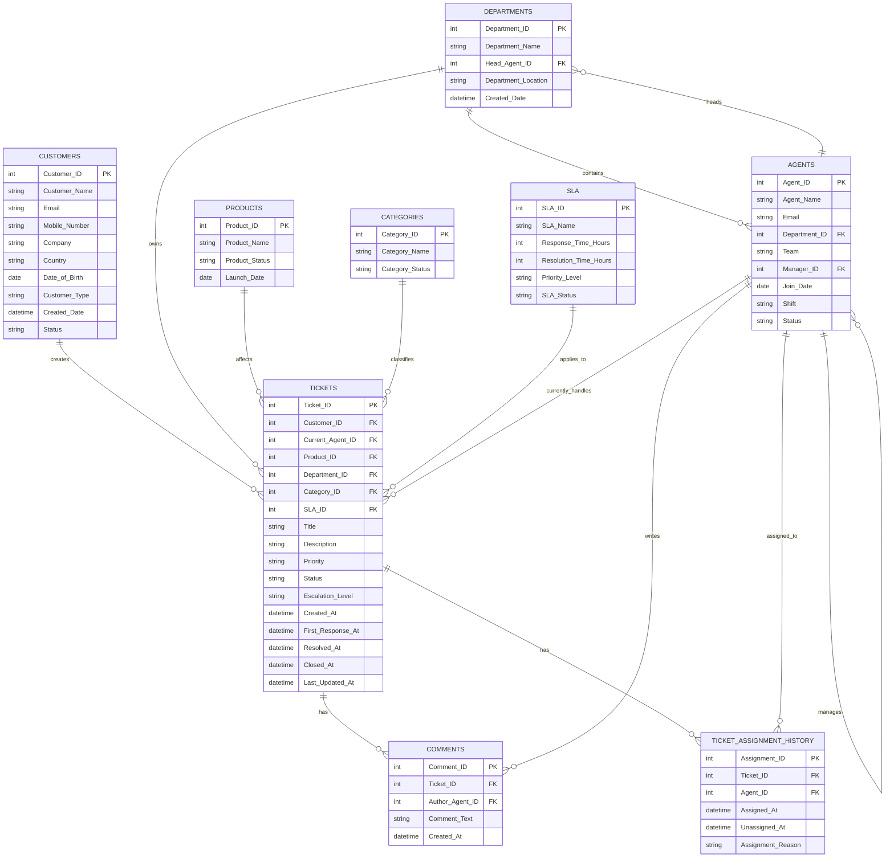

# CloudDesk Customer Support Intelligence Platform
## Sprint 0 — Project Foundation & Data Model

**Status:** Complete  
**Version:** 1.0  
**Purpose:** Blueprint for an end-to-end, production-style data engineering portfolio project.

---

## 1. Business Problem

CloudDesk Solutions is a fictional SaaS company receiving thousands of customer-support tickets.

Management needs a centralized analytics platform to understand:

- Ticket volume and trends
- SLA compliance
- Agent performance
- Product-related issues
- Customer issues
- Escalations
- Resolution times
- Ticket backlog

The goal is to build an end-to-end data platform that ingests operational data, validates and transforms it, and provides business-ready analytics through Power BI.

---

## 2. Project Scope

The platform will cover:

API → Python → MySQL → Databricks/PySpark → Bronze → Silver → Gold → SQL → Power BI → Automation → Documentation → GitHub

The project is intentionally designed to resemble a real company data platform rather than a simple dashboard project.

---

## 3. Technology Stack

| Layer | Technology | Purpose |
|---|---|---|
| Learning API | GitHub REST API | Learn authentication, pagination, JSON and rate limits |
| Main API | Python FastAPI | Simulated internal CloudDesk support API |
| Ingestion | Python | Extract data from APIs and load source data |
| Operational DB | MySQL | Simulates the application's transactional database |
| Processing | Databricks + PySpark | Data engineering and scalable transformations |
| Storage | Delta | Reliable Bronze/Silver/Gold data layers |
| Analytics | SQL | Analytical querying and business logic |
| Visualization | Power BI | Business dashboards |
| Automation | Scheduled jobs | Automated pipeline execution |
| Version Control | Git + GitHub | Source control and portfolio |
| Documentation | Markdown + diagrams | Project documentation |

---

## 4. Business Entities

The operational system contains:

1. Customers
2. Agents
3. Departments
4. Products
5. Categories
6. SLA
7. Tickets
8. Comments
9. Ticket Assignment History

---

## 5. Business Rules

- One customer can create many tickets.
- One agent can handle many tickets.
- One agent belongs to one department in Version 1.
- One department can have many agents.
- One department can have many tickets.
- One product can have many tickets.
- One category can have many tickets.
- One SLA can apply to many tickets.
- One ticket can have many comments.
- One ticket can have many assignment-history records.
- A ticket stores the current agent while assignment history preserves previous assignments.
- Historical records should not be unnecessarily overwritten.

---

## 6. Operational Database Tables

### Customers

- Customer_ID — PK
- Customer_Name
- Email
- Mobile_Number
- Company
- Country
- Date_of_Birth
- Customer_Type
- Created_Date
- Status

### Agents

- Agent_ID — PK
- Agent_Name
- Email
- Department_ID — FK
- Team
- Manager_ID — FK to Agents
- Join_Date
- Shift
- Status

### Departments

- Department_ID — PK
- Department_Name
- Head_Agent_ID — FK to Agents
- Department_Location
- Created_Date

### Products

- Product_ID — PK
- Product_Name
- Product_Status
- Launch_Date

### Categories

- Category_ID — PK
- Category_Name
- Category_Status

### SLA

- SLA_ID — PK
- SLA_Name
- Response_Time_Hours
- Resolution_Time_Hours
- Priority_Level
- SLA_Status

### Tickets

- Ticket_ID — PK
- Customer_ID — FK
- Current_Agent_ID — FK
- Product_ID — FK
- Department_ID — FK
- Category_ID — FK
- SLA_ID — FK
- Title
- Description
- Priority
- Status
- Escalation_Level
- Created_At
- First_Response_At
- Resolved_At
- Closed_At
- Last_Updated_At

### Comments

- Comment_ID — PK
- Ticket_ID — FK
- Author_Agent_ID — FK
- Comment_Text
- Created_At

### Ticket_Assignment_History

- Assignment_ID — PK
- Ticket_ID — FK
- Agent_ID — FK
- Assigned_At
- Unassigned_At
- Assignment_Reason

---

## 7. ER Diagram



---

## 8. End-to-End Architecture

```text
CloudDesk Support API
        |
        v
Python Ingestion
        |
        v
MySQL Operational Database
        |
        v
Data Extraction
        |
        v
Databricks + PySpark
        |
        +------> Bronze (raw)
        |
        +------> Silver (validated/cleaned)
        |
        +------> Gold (business-ready)
                         |
                         v
                    SQL Analytics
                         |
                         v
                      Power BI
                         |
                         v
                    Automation
                         |
                         v
                  Monitoring/Logs
                         |
                         v
                    GitHub + Docs
```

---

## 9. Bronze / Silver / Gold

### Bronze
Raw source data with minimal transformation.

### Silver
Validated and cleaned data:
- Duplicate detection
- Required-field validation
- Data type validation
- Invalid foreign-key detection
- Timestamp standardization
- Status/priority standardization

### Gold
Business-ready analytical model.

Planned model:

- Fact_Tickets
- Dim_Customer
- Dim_Agent
- Dim_Product
- Dim_Department
- Dim_Category
- Dim_SLA
- Dim_Date

---

## 10. Real-World Engineering Features

The finished platform should demonstrate:

- REST API integration
- Authentication
- Pagination
- Incremental extraction
- Raw data preservation
- Data validation
- Duplicate detection
- Error handling
- Logging
- Assignment history
- PySpark transformations
- Delta tables
- Star-schema analytics
- Power BI reporting
- Automated execution
- Git version control
- Technical documentation

---

## 11. API Strategy

### Phase 1 — Real API

Use the GitHub REST API to learn:

- HTTP requests
- Authentication
- Pagination
- Rate limiting
- JSON structures
- Incremental ingestion concepts

### Phase 2 — CloudDesk API

Build our own FastAPI service.

Synthetic support data will be generated using Python/Faker plus business rules and stored in MySQL.

Flow:

```text
Python Data Generator
        |
        v
MySQL
        |
        v
FastAPI
        |
        v
REST Endpoints
        |
        v
Python Ingestion
```

This gives the project both a realistic data producer and a realistic data consumer.

---

## 12. Sprint 0 Definition of Done

- [x] Business problem defined
- [x] Business requirements defined
- [x] Technology stack selected
- [x] Business entities identified
- [x] Business rules defined
- [x] Operational schema designed
- [x] Primary/foreign keys identified
- [x] Relationships defined
- [x] Assignment history designed
- [x] ER diagram created
- [x] End-to-end architecture defined
- [x] Bronze/Silver/Gold strategy defined
- [x] API strategy defined

**Sprint 0 Status: COMPLETE**

---

## 13. Next Sprint

### Sprint 1 — API & Data Ingestion

First implementation goal:

```text
GitHub REST API
      |
      v
Python
      |
      v
Successful API request
      |
      v
Understand JSON response
      |
      v
Handle pagination
      |
      v
Store raw response
```

No Databricks or Power BI yet.

We will build one layer at a time.
